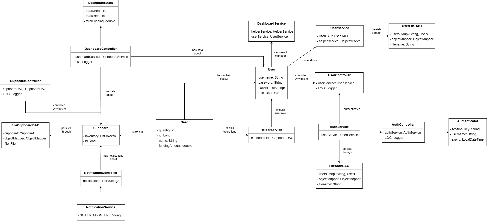
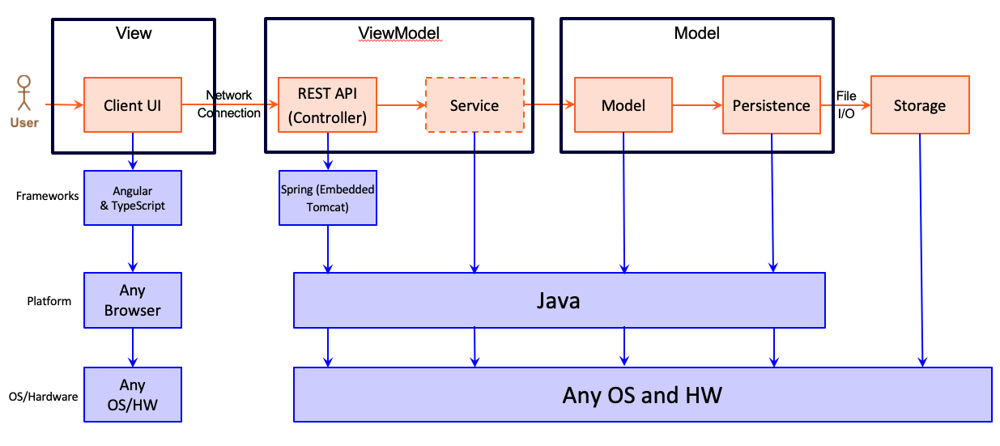
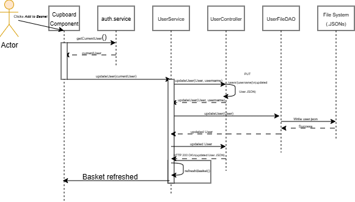

**Books for the Future** is a semester-long group software engineering project for a fictional non-for-profit we created.
My team designed and implemented a platform that helps users search, browse, and manage school supplies needs with an intuitive interface and a clean architecture focused on reliability, maintainability, and future extensibility.

The project showcases our work across the full development cycle inluding requirements gathering, design modeling, iterative implementation, and sprint-based development practices. Below is an overview of the system and a visual highlight of our process.

- A searchable and filterable catalog of books  
- Category-based browsing  
- User-focused interface design  
- A scalable multi-tier architecture following established design principles
- Comprehensive developer documentation and diagrams

The MVP of this project:
1. User management
2. User login capability
2. Creation, viewing, and management of school supplies basket (Funding baskets)
3. Finalization to lock completed baskets. 
4. Interface that allows for smooth navigation and interaction. 

## MVP Features

1. Admin Login (5) - As a U-fund Manager, I want to log in using the reserved username admin so that I can manage the organization's needs cupboard.

2. Helper Login (8) - As a Helper I want to login to the UFund app so that I can access the needs cupboard and view my basket.

3. Search Needs in cupboard (8) - As a Helper I want to search for a particular need so that I can easily find what things exist or do not exist.

4. Create New Need (8) - As a Manager/Admin I want to submit a request to create a new need so that it is added to the cupboard.

5. Edit an Existing Need(5) - As a Helper I want to edit the details of an existing need in the cupboard 

6. Remove Needs from Cupboard(5) - As a Helper I want to add/remove needs from my funding basket so that I can change the status of available needs.

7. Browse Needs (5) - As a Helper I want to see a list of needs so that I choose which ones to contribute to.

8. Checkout Needs(5) - As a Helper I want to add/remove needs from my funding basket so that I can change the status of available needs.

9. Populate Cupboard - As a Helper I want to add needs from my funding basket so that I can change the status of available needs.

10. Modify Funding Basket(5) - As a Helper I want to review all the needs currently in my funding basket so that I can confirm, update, or remove them before finalizing their status.

## Application Domain

The main entities and relationships of the project:
1. Helper: Primary user, can manage their own basket and Needs.
2. Funding Basket: Group of needs asscoiated with a helper.
3. Need: Individual resource item with description, quantity, and other metadata.
4. Manager: Admin user, can modify current needs in the Cupboard, or create new ones. Has access to updated information about the initiative (# of needs, users, etc).
5. Cupboard: Needs posted by Managers available for Helpers to browse, checkout, etc.

## Architecture and Design

The web application, is built using the Model–View–ViewModel (MVVM) architecture pattern. 

The Model stores the application data objects including any functionality to provide persistance. 

The View is the client-side SPA built with Angular utilizing HTML, CSS and TypeScript. The ViewModel provides RESTful APIs to the client (View) as well as any logic required to manipulate the data objects from the Model.

### View Tier

This platform was developed collaboratively using Agile methods, including sprint planning, backlog management, version control with Git, and continuous team coordination.

Between development milestones, we documented decisions, analyzed code impacts, and applied object-oriented software engineering principles such as the Single Responsibility Principle, Open/Close principle, Low Coupling, and Information Expert.

1. Information Expert
  - Responsibility is assigned to the class that has the necessary information to complete fulfill it.
  - The Need class, for example, is responsible for maintaining its own quantity, fund status, and metadata rather than having another class track it.
  - Another example is the DashboardStats class. This class handles important statistics about users and cupboard contents because it has access to all relevant data to do so.

2. Single Responsibility Principle (SRP)
 - Each class has a it's own clear purpose:
 - For example, the Controller Classes:
     CupboardController only handles HTTP requests related to cupboards.
     Notification Controller is soley responsible for managing notification data.
     NotificationService is responsible for sending notifications between the backend and frontend.
 - DAO classes:
      Each DAO handles data for a single entity. If the strategy of storing data changes, only this class needs to be updated.

3. Low Coupling
- Each service and controller only interacts through clear itnerfaces (REST endpoints).
- For example: The NotificationService doesn't directly modify any controllers state. It only makes HTTP requests, so changing its implementation will not break other classes.
- This design principle allows our classes to be cohesive but still loosely connected.

4. Open/Closed
- Our software entities (classes, modules, functions) are open for extension but closed for modification. This means we could easily add new functionality without changing exisiting, tested code.
- The notification system is designed to be extensible. New types of notifications can be added without changing the existing backend or UI logic.
- The Filtering and Sorting utilities in the Needs cupboard can be extended to include new criteria without modifying the substance of the CupboardComponent or service logic.
- DAO classes are designed so that changed to the persistence do not require modifications to main business logic.

## Final Prototype & Features

After weeks of building, testing, and refining, we produced a functioning prototype that demonstrates our full end-to-end workflow: from data handling and logic to UI rendering and user interactions.

## How We Built It

We used multiple technologies and methods:

- **Java** as the primary language  
- **Spring Boot** as the Java framework
- **Model–View–Controller (MVC)** architecture  
- **Git & GitHub** workflow with feature branches  
- **Agile sprints**, retrospective evaluations, and task-driven planning  
- **UML diagrams**, sequence diagrams, class models, and architecture documentation  
- **Design principles** such as Infromation Expert, Seperation of Concerns, Low Coupling, and Open/Closed.

This project demonstrates not only the technical outcome but also our team's growth in communication, collaboration, and design thinking.

---